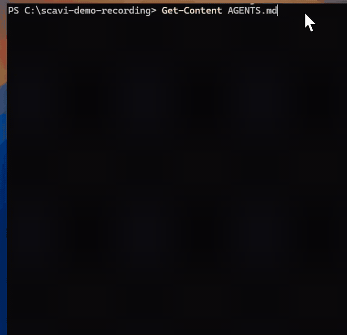
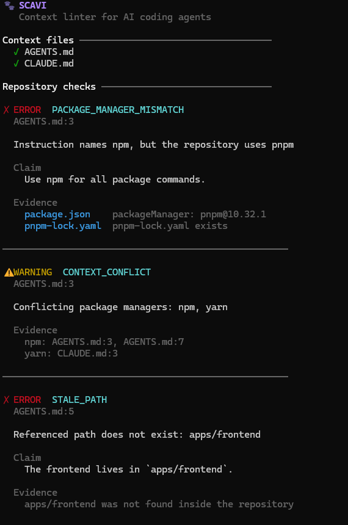
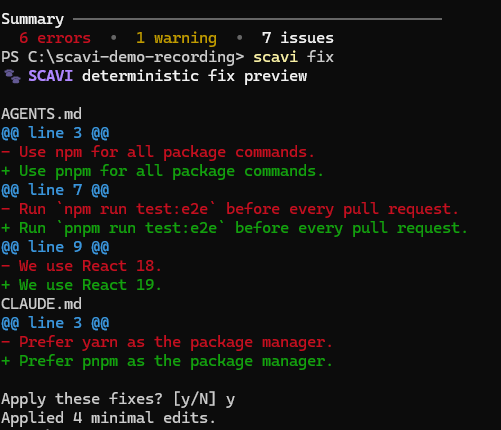
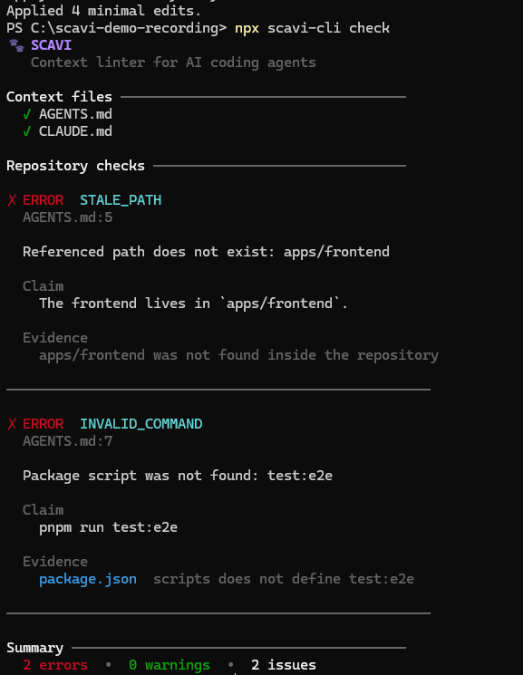

<p align="center">
  
</p>

# Scavi

### The context linter for AI coding agents.

**Keep your agents in sync with your code.**

Scavi is an open-source developer tool that helps keep AI coding instructions accurate as your codebase evolves.

It checks files like `AGENTS.md`, `CLAUDE.md`, Cursor rules, Copilot instructions, and other agent context for **stale information, conflicting rules, invalid paths, outdated commands, and claims that no longer match your codebase**.

Think of it as a linter for the context you give your coding agents.

---

## Installation

Run Scavi directly in the repository you want to check:

```bash
cd path/to/your-repository
npx scavi-cli check
```

Or install it globally:

```bash
npm install --global scavi-cli
cd path/to/your-repository
scavi check
```

Scavi looks for context files in the repository being checked. If you run it from a directory without files such as `AGENTS.md`, `CLAUDE.md`, Copilot instructions, or Cursor rules, it will report `None found`. You can also pass the repository path explicitly:

```bash
scavi check ./my-project
```

---

## Demo

See Scavi detect inconsistent repository context and preview deterministic fixes:

<p align="center">
  <a href="docs/assets/scavi-demo.mp4">
    
  </a>
</p>

<p align="center"><sub>Click the demo to open the full-quality MP4.</sub></p>

<details>
<summary><strong>View terminal screenshots</strong></summary>

### Detect stale context



### Preview deterministic fixes



### Keep uncertain problems for a human



</details>

---

## The problem

AI coding agents are becoming part of everyday development workflows.

To work effectively, they increasingly rely on repository-level instructions such as:

```text
AGENTS.md
CLAUDE.md
GEMINI.md
.github/copilot-instructions.md
.cursor/rules/*.mdc
```

These files tell agents how a project is structured, which commands to use, where components live, which conventions to follow, and how the application behaves.

But code changes constantly.

Agent instructions often don't.

A repository might say:

```md
Frontend lives in /frontend.

Use npm test before submitting changes.

Configuration is stored in config.json.
```

while the actual project has already moved to:

```text
/apps/web
pnpm test
SQLite
```

The instructions still look perfectly valid.

They're just wrong.

And now every AI agent working on the repository starts with bad context.

---

## Meet Scavi

Scavi digs through your repository and checks whether your AI coding context still matches reality.

```bash
npx scavi-cli check
```

Example:

```text
🐾 Scavi is digging through your repo...

AI Context Health: 72/100

✗ AGENTS.md:18
  Outdated path

  "Frontend is located in /frontend"

  /frontend does not exist.
  Probable location: /apps/web


✗ CLAUDE.md:32
  Invalid command

  "Run npm test before committing"

  Repository uses pnpm.


⚠ CONFLICT

  AGENTS.md:18
  "Use pnpm"

  CLAUDE.md:31
  "Use npm"

  Repository evidence:
  pnpm-lock.yaml


⚠ POSSIBLY STALE

  AGENTS.md:51
  "Configuration is stored in config.json"

  Repository evidence suggests configuration
  is currently stored in SQLite.

  Confidence: 91%


3 context issues found.
```

---

## What Scavi checks

### Stale instructions

Scavi detects instructions that no longer match the current codebase.

Examples:

* outdated architecture descriptions
* removed directories
* renamed components
* old configuration mechanisms
* obsolete workflows

### Broken references

Scavi can verify things that don't require an LLM:

* file paths
* directories
* package scripts
* package managers
* dependencies
* configuration files
* commands
* referenced project files

### Conflicting instructions

Different coding agents shouldn't receive different versions of reality.

Scavi can detect contradictions between:

```text
AGENTS.md
CLAUDE.md
GEMINI.md
Cursor rules
Copilot instructions
```

For example:

```text
AGENTS.md
→ Use pnpm.

CLAUDE.md
→ Use npm.

.cursor/rules/project.mdc
→ Use yarn.
```

Scavi uses repository evidence to help determine which instruction is likely correct.

### Semantic drift

Not everything can be verified with simple static checks.

For claims about architecture, application behavior, data flow, or implementation details, Scavi can retrieve relevant code and use an LLM to determine whether the instruction still reflects the current implementation.

This is where Scavi's retrieval and AI layer comes in.

Semantic verification is opt-in. Scavi first indexes text files locally, retrieves only the most relevant chunks, and sends only the claim plus those chunks to the configured provider. If retrieval finds no relevant evidence, Scavi returns `uncertain` without calling the provider. Provider verdicts below the configured confidence threshold are also downgraded to `uncertain`.

For example, given this context:

```text
AGENTS.md:3
Configuration is persisted in JSON files.
```

and repository code that opens `settings.sqlite` and writes to a `settings` table, Scavi retrieves only that relevant code and reports:

```text
⚠ POSSIBLY_STALE

Claim:
  Configuration is persisted in JSON files.

Verdict:
  stale (92%)

Evidence:
  src/storage.ts:1-8
```

This path was verified end-to-end with OpenAI using `gpt-5-mini`. The lexical retrieval step remains deterministic and local.

---

## Fix, don't just report

Scavi is designed to help fix context drift, not only complain about it.

```bash
npx scavi-cli fix
```

Scavi will generate minimal suggested changes for detected issues.

You stay in control — proposed changes are reviewed before being applied.

---

## GitHub Actions

Scavi includes a JavaScript Action that uses the same core and deterministic rules as the CLI. It writes a Markdown job summary, exposes issue counts as outputs, and can include files changed since a pull request base revision.

```yaml
steps:
  - uses: actions/checkout@v4
    with:
      fetch-depth: 0

  - uses: hsr88/scavi@v0
    with:
      diff-base: ${{ github.event.pull_request.base.sha }}
      fail-on-deterministic: true
```

A pull request that changes application behavior could produce a check like:

```text
🐾 Scavi — AI Context Check

2 potential context issues found.

🔴 AGENTS.md
   Outdated architecture instruction

🟡 .cursor/rules/backend.mdc
   Potentially affected by this PR

This PR moved authentication from:

/lib/auth

to:

/services/auth

AGENTS.md still instructs coding agents
to modify /lib/auth.

Suggested fix available.
```

The goal is simple:

**don't let stale AI context reach `main`.**

---

## Supported context

Planned support includes:

| Context                     | Status     |
| --------------------------- | ---------- |
| `AGENTS.md`                 | ✅ Deterministic checks |
| `CLAUDE.md`                 | ✅ Deterministic checks |
| `GEMINI.md`                 | ✅ Deterministic checks |
| GitHub Copilot instructions | ✅ Deterministic checks |
| Cursor rules                | ✅ Deterministic checks |
| Custom instruction files    | ✅ Configured paths/globs |

---

## CLI

Core commands are available in `scavi-cli@0.1.3`. The semantic control flags below are part of the current `0.1.4` development branch:

```bash
# Configure Scavi without overwriting an existing config
scavi init

# Check AI coding context
scavi check

# Machine-readable output
scavi check --format json

# Enable optional semantic verification
scavi check --semantic

# Approve external analysis in CI or another non-interactive shell
scavi check --semantic --yes

# Ignore cached semantic verdicts for this run
scavi check --semantic --no-cache

# Check an explicit repository path
scavi check ./my-project

# Preview minimal deterministic fixes and approve before applying
scavi fix
```

### Optional semantic verification

Semantic checks are disabled by default. Enable them explicitly in `scavi.config.ts`:

```ts
export default {
  context: ["AGENTS.md", "CLAUDE.md"],
  checks: {
    semantic: true,
    semanticConfidence: 0.6,
    semanticMaxClaims: 20,
    semanticEvidenceLimit: 5,
  },
  ai: {
    provider: "openai",
    model: "gpt-5-mini",
  },
};
```

Then provide the key through the environment:

```bash
OPENAI_API_KEY=your-key scavi check
```

Scavi uses the OpenAI Responses API with stored responses disabled. Repository content is treated as untrusted data. A semantic request contains one claim and a small set of locally retrieved evidence chunks—not the full repository. Deterministic mode does not require a key or make network requests.

`semanticConfidence` controls the minimum confidence required before a provider verdict can become a semantic warning. It defaults to `0.6`; results below the threshold are reported as `uncertain` and never fail CI.

`semanticMaxClaims` and `semanticEvidenceLimit` bound external work. Before the first OpenAI request, the CLI shows the provider, model, maximum claim count, and evidence limit. Use `--yes` only after approving this in automation.

Semantic verdicts are cached locally in `.scavi/cache/` using a hash of the claim, evidence, provider, and model. Cache entries contain the verdict and reason, not repository source code. Scavi creates `.scavi/.gitignore` automatically.

For fully local semantic verification, run Ollama and configure:

```ts
ai: {
  provider: "ollama",
  model: "your-local-model",
  baseUrl: "http://localhost:11434",
}
```

The Ollama adapter uses its local `/api/chat` endpoint with streaming disabled, temperature `0`, and a JSON schema for the verdict.

See the [semantic evaluation guide](docs/SEMANTIC_EVALS.md) for the 14-case OpenAI/Ollama comparison runner. See [real-world beta results](docs/REAL_WORLD_BETA.md) for deterministic scans of five repositories.

Or without installing globally:

```bash
npx scavi-cli check
```

---

## How it works

Scavi combines deterministic analysis with AI-assisted semantic verification.

```text
                    ┌─────────────────┐
                    │   Repository    │
                    └────────┬────────┘
                             │
                  ┌──────────▼──────────┐
                  │  Context Discovery  │
                  └──────────┬──────────┘
                             │
              ┌──────────────┴──────────────┐
              │                             │
     ┌────────▼────────┐           ┌────────▼────────┐
     │ Static Checks   │           │ Semantic Checks │
     │                 │           │                 │
     │ paths           │           │ architecture    │
     │ commands        │           │ behavior        │
     │ dependencies    │           │ implementation  │
     │ scripts         │           │ relationships   │
     └────────┬────────┘           └────────┬────────┘
              │                             │
              │                    ┌────────▼────────┐
              │                    │ Retrieval / RAG │
              │                    └────────┬────────┘
              │                             │
              │                    ┌────────▼────────┐
              │                    │      LLM        │
              │                    └────────┬────────┘
              │                             │
              └──────────────┬──────────────┘
                             │
                    ┌────────▼────────┐
                    │ Context Report  │
                    └────────┬────────┘
                             │
                       check / fix
```

The important principle is:

> **Don't use an LLM for something that can be verified deterministically.**

A missing directory doesn't need AI.

A claim about how authentication flows through the application probably does.

---

## Why Scavi?

Coding agents are only as reliable as the context they receive.

As repositories evolve, AI instructions can accumulate outdated assumptions, duplicated rules, conflicting guidance, and references to code that no longer exists.

Scavi aims to make AI context a maintainable part of the software development lifecycle — something that can be **checked, reviewed and tested**, just like code.

---

## Roadmap

### v0.1 — Digging begins 🐾

* [x] CLI foundation
* [x] Context file discovery
* [x] `AGENTS.md` support
* [x] `CLAUDE.md` support
* [x] Cursor rules support
* [x] Copilot instructions support
* [x] Path validation
* [x] Command and package-manager validation
* [x] Dependency checks
* [x] `scavi init`
* [x] Custom context paths and globs
* [x] Cross-file package-manager contradiction detection
* [x] Optional semantic verification with evidence and confidence
* [x] Local lexical repository retrieval
* [x] OpenAI Responses API provider
* [x] Local Ollama provider
* [x] `scavi check`
* [x] Deterministic `scavi fix`
* [x] GitHub Action
* [x] PR-aware job summary and outputs

### Later

* [ ] Additional agent formats
* [ ] Context Health score
* [ ] Context size and duplication analysis
* [ ] Historical drift detection
* [ ] MCP integration
* [ ] Evaluation suite
* [ ] Optional web dashboard

---

## Philosophy

Scavi should be:

**Local-first where possible.**
Repository analysis should stay local unless external AI services are explicitly used.

**Transparent.**
Every warning should explain what Scavi found and why it considers something incorrect.

**Evidence-based.**
AI-generated conclusions should point back to repository evidence.

**Conservative with fixes.**
Scavi should suggest minimal changes rather than rewrite entire instruction files.

**Agent-agnostic.**
Your repository shouldn't need a different source of truth for every coding agent.

---

## Status

> 🚧 **Scavi is currently in early development.**

The first goal is a usable CLI and GitHub Action capable of detecting stale and conflicting AI coding instructions against a real codebase.

If this problem sounds familiar, feedback and ideas are welcome.

---

## Contributing

Scavi is being built in the open.

Issues, ideas, test repositories, edge cases, and pull requests are welcome.

Especially useful are real-world examples of:

* stale `AGENTS.md` instructions
* conflicting agent configuration
* outdated architecture descriptions
* broken paths or commands
* AI agents making mistakes because of outdated repository context

---

## License

MIT

---

<p align="center">
  <strong>🐾 Scavi</strong><br>
  The context linter for AI coding agents.<br>
  <em>Keep your agents in sync with your code.</em>
</p>
